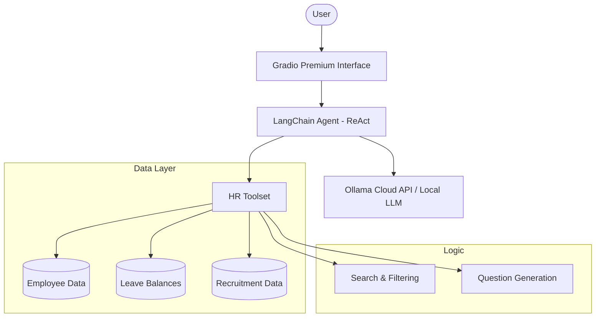

# HR Assistant

An intelligent, agentic AI assistant designed to automate HR data queries, leave management, and recruitment workflows. Built with **LangChain**, **Ollama**, and **Gradio**.

## 🌟 Overview

The HR Assistant is a technical demonstration of an **AI Agent** capable of interacting with structured company data (CSV) to provide instant answers to employee and HR queries. It uses the **ReAct (Reasoning and Acting)** pattern to decide which tools to use for any given question.

---

## 🏗️ Architecture



---

## 🔒 Data Privacy & Production Path

> [!IMPORTANT]
> **Current Configuration:** This demo currently uses the **Ollama Cloud API** for model inference. While excellent for prototyping, this means data segments are processed on external servers.

### 🛡️ Moving to Private Production
For a production environment requiring 100% data privacy (standard for HR):
1.  **Truly Local LLM:** Switch the `base_url` in `agent/llm.py` to a local Ollama instance (`http://localhost:11434`). This ensures **zero data leaves your infrastructure**.
2.  **Hardware Requirements:** Running high-performance local models (like Llama-3 70B) requires a dedicated server with a modern GPU (e.g., NVIDIA A100 or H100) or high-memory Apple Silicon.
3.  **Data Masking:** Use PII redirection layers to anonymize employee names before they reach the LLM logic.

---

## 🚀 Key Features

- **🔍 Employee Profile Search:** Get instant details on titles, departments, and supervisors.
- **📊 Leave Management:** Check annual, sick, and personal leave balances for any employee ID.
- **💼 Recruitment Support:** Generate role-specific, intelligent interview questions based on company history.
- **🎨 Premium Dark UI:** A sleek, high-contrast dark interface designed for professional environments.
- **✅ Robust Testing:** Comprehensive test suite built with `pytest` for reliable tool operations.

---

## 🛠️ Technical Stack

- **Framework:** LangChain (ReAct Agent)
- **Model:** Ollama (gpt-oss:120b)
- **UI:** Gradio (Custom Theme + Premium CSS)
- **Language:** Python 3.10+
- **Testing:** Pytest

---

## 💻 Installation & Setup

1. **Clone the repository:**
   ```bash
   git clone <repository-url>
   cd HR_Assistant
   ```

2. **Setup Virtual Environment:**
   ```bash
   python -m venv Hrvenv
   .\Hrvenv\Scripts\activate
   pip install -r requirements.txt
   ```

3. **Environment Variables:**
   Create a `.env` file in the root:
   ```env
   OLLAMA_API_KEY=your_api_key_here
   OLLAMA_MODEL=gpt-oss:120b
   OLLAMA_BASE_URL=https://ollama.com
   ```

4. **Run the Application:**
   ```bash
   python app.py
   ```

---

## 🧪 Testing

The project includes a full unit testing suite to ensure data integrity and tool reliability:
```bash
pytest tests/
```

---

## 📄 License
This project is for educational and portfolio demonstration purposes.
